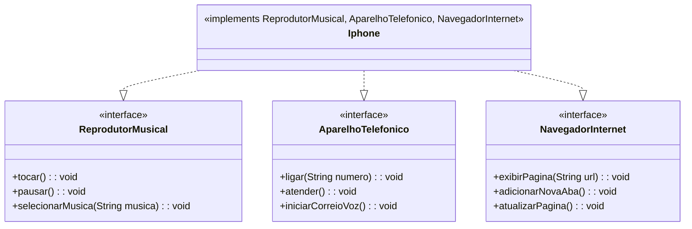

# 📱 UML do Componente Iphone | Desafio DIO - Trilha Java Básico - POO

Este repositório contém a modelagem UML do componente iPhone, representando suas interfaces principais: Reprodutor Musical, Aparelho Telefônico e Navegador de Internet.
Este projeto faz parte do Desafio DIO - Trilha Java Básico - POO, explorando conceitos de Programação Orientada a Objetos (POO) aplicados à linguagem Java.


## 📑 Descrição

O diagrama de classes foi criado utilizando [Mermaid](https://mermaid.js.org/), uma ferramenta para diagramas e gráficos. Além do diagrama, o projeto inclui a implementação das interfaces em Java, seguindo os princípios de POO.

## 🔍 Diagrama UML

Aqui está a representação UML do componente **Iphone** e suas interfaces:

### 📜 Código UML em Mermaid


### 🖥️ Código-fonte em Java
Aqui estão os arquivos do projeto, organizados no diretório `DesafioIUmlIphone/src/iphone`:

- [Main.java](./DesafioIUmlIphone/src/iphone/Main.java)
- [Iphone.java](./DesafioIUmlIphone/src/iphone/Iphone.java)
- [ReprodutorMusical.java](./DesafioIUmlIphone/src/iphone/ReprodutorMusical.java)
- [AparelhoTelefonico.java](./DesafioIUmlIphone/src/iphone/AparelhoTelefonico.java)
- [NavegadorInternet.java](./DesafioIUmlIphone/src/iphone/NavegadorInternet.java)

## 🏗️ Como executar o projeto

1. Clone o repositório:
   ```sh
   git clone https://github.com/ltsilva23/Desafio-UML-Iphone-Dio.git
   ```
2. Abra o projeto em sua IDE favorita.
3. Compile e execute os arquivos Java.

## 🤝 Contribuição

Sinta-se à vontade para contribuir com melhorias! Basta seguir os passos abaixo:
- Faça um **fork** do repositório.
- Crie uma **branch** com sua alteração.
- Envie um **pull request**.
